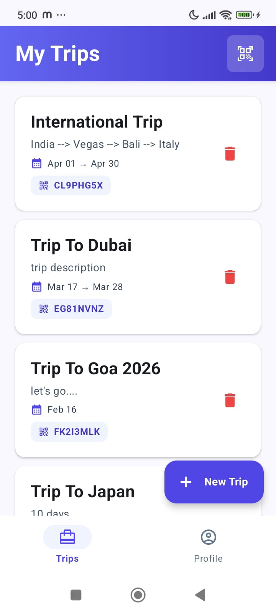
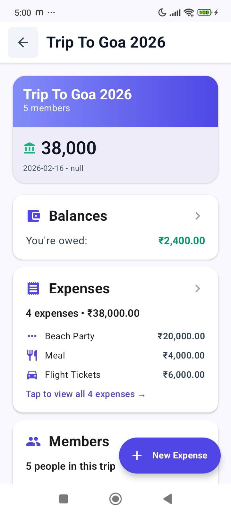
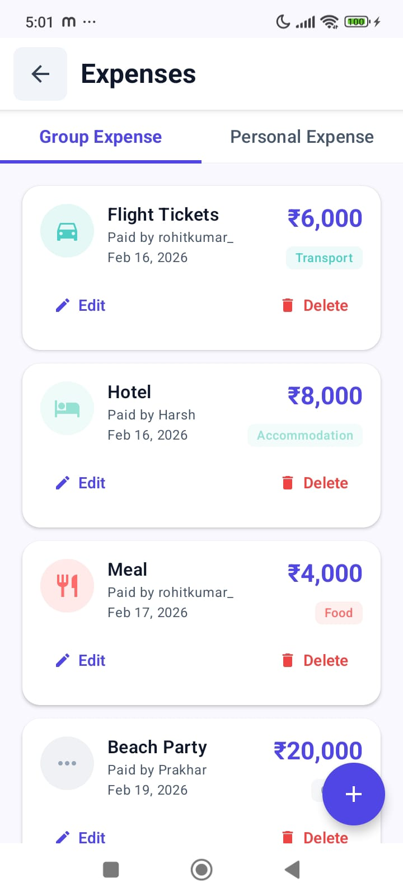
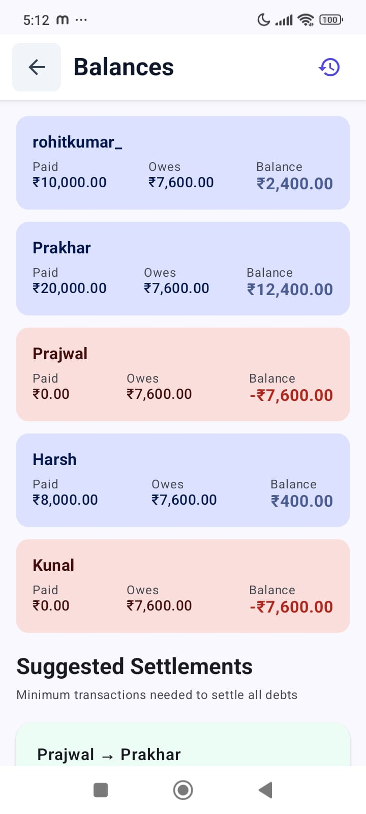

# Splitify 💸

A collaborative expense tracking Android app built with Kotlin, Jetpack Compose, and Supabase. Track shared expenses during trips and events with real-time sync and smart debt simplification.

<!-- <p align="center">
  
</p> -->

## ✨ Features

- **Trip Management** – Create trips, add members (app users or guests), manage settings
- **Smart Expense Splitting** – Split bills equally or customize participant lists per expense
- **Debt Simplification** – Graph-based algorithm minimizes settlement transactions
- **Real-time Collaboration** – Multiple users can edit the same trip simultaneously
- **Offline-First Architecture** – Full functionality without internet, auto-sync when online
- **Settlement Workflow** – Two-step confirmation system (mark paid → confirm receipt)
- **Insights & Analytics** – Spending breakdown by category, member, and timeline
- **Material Design 3** – Modern UI with dynamic theming

## 📱 Screenshots

| Trips List | Trip Detail | Add Expense | Balances |
|------------|-------------|-------------|----------|
|  |  |  |  |

## 🏗️ Architecture

**Clean Architecture** with three layers:

```
presentation/ (UI)
    ↓
domain/ (Business Logic)
    ↓
data/ (Data Sources)
```

- **Presentation:** Jetpack Compose + MVVM + StateFlow
- **Domain:** Use cases, repository interfaces, domain models
- **Data:** Room (local) + Supabase (remote) with Repository pattern

### Tech Stack

| Category | Technology |
|----------|-----------|
| **Language** | Kotlin |
| **UI** | Jetpack Compose, Material Design 3 |
| **Architecture** | MVVM, Clean Architecture |
| **DI** | Hilt |
| **Local DB** | Room |
| **Backend** | Supabase (PostgreSQL, Auth, Realtime, Storage) |
| **Async** | Kotlin Coroutines, Flow |
| **Image Loading** | Coil |

## 🚀 Getting Started

### Prerequisites

- Android Studio Hedgehog (2023.1.1) or later
- JDK 17+
- Android SDK 24+
- Supabase account ([sign up](https://supabase.com))

### Installation

1. **Clone the repository**
   ```bash
   git clone https://github.com/codingwithrohit/Splitify.git
   cd splitify
   ```

2. **Configure Supabase**
   
   Create `local.properties` in the project root:
   ```properties
   SUPABASE_URL=https://your-project.supabase.co
   SUPABASE_KEY=your-anon-public-key
   ```

3. **Set up Supabase database**
   
   Run the SQL script from `database/schema.sql` in your Supabase SQL Editor:
   ```bash
   # Copy the contents of database/schema.sql and run in Supabase
   ```

4. **Sync Gradle**
   ```bash
   ./gradlew build
   ```

5. **Run the app**
   - Select your device/emulator
   - Click Run ▶️ in Android Studio

### Database Setup (Supabase)

The app requires these tables:
- `users` – User profiles
- `trips` – Trip information
- `trip_members` – User-trip relationships
- `expenses` – All expenses
- `expense_splits` – Split calculations
- `settlements` – Payment records

**Important:** Row Level Security (RLS) policies are configured to ensure data privacy. See `database/schema.sql` for complete setup.


## 📂 Project Structure

```
app/src/main/java/com/example/splitify/
│
├── data/
│   ├── local/          # Local data sources (Room DB, DAOs, entities)
│   ├── remote/         # Remote data sources (Supabase APIs, DTOs)
│   ├── repository/     # Repository implementations
│   └── sync/           # Data synchronization logic
│
├── domain/
│   ├── model/          # Core domain models
│   ├── repository/     # Repository interfaces (contracts)
│   └── usecase/        # Business logic & application rules
│
├── presentation/
│   ├── addmembers/     # Add members screen
│   ├── auth/           # Authentication (login/register)
│   ├── balances/       # Balance & settlement overview
│   ├── components/     # Reusable UI components
│   ├── expense/        # Add/Edit expense screens
│   ├── insights/       # Analytics & insights screen
│   ├── jointrip/       # Join trip screen
│   ├── navigation/     # Navigation setup (NavGraph)
│   ├── profile/        # User profile screen
│   ├── session/        # Session management
│   ├── settlement/     # Settlement handling
│   ├── theme/          # Material 3 theming
│   ├── tripdetail/     # Trip details screen
│   └── trips/          # Trips listing screen
│
├── di/                         # Dependency Injection (Hilt modules)
├── util/                       # Utilities & extensions
├── MainActivity.kt             # Main activity & app navigation host
└── SplitifyApplication.kt      # Application class (Hilt setup & app-level config)

```

## 🔄 Offline-First Strategy

1. **Write to Room first** → Instant UI updates
2. **SyncManager queues changes** → Background tracking
3. **WorkManager syncs** → When network available
4. **Conflict resolution** → Last-write-wins with timestamps

User experience: App feels instant even without internet. Data syncs transparently in the background.

## 🧮 Debt Simplification Algorithm

**Problem:** After multiple expenses, minimize the number of transactions needed to settle all debts.

**Solution:** Graph-based greedy algorithm

```kotlin
// Example:
// A paid ₹300, B paid ₹200, C paid ₹0 (total ₹500, 3 people)
// 
// Net balances:
// A: +₹133.33 (creditor)
// B: +₹66.67 (creditor)
// C: -₹200 (debtor)
//
// Simplified settlements:
// C → A: ₹133.33
// C → B: ₹66.67
// 
// Result: 2 transactions instead of 3+
```

See `SimplifyDebtsUseCase.kt` for implementation.

## 🔐 Security

- Supabase RLS policies enforce data isolation
- Users can only access trips they created or joined
- Admin-only actions (delete members, edit any expense)
- Encrypted SharedPreferences for auth tokens

## 🐛 Known Issues & Learnings

### Infinite RLS Recursion (Solved)
**Problem:** Supabase RLS policies caused stack overflow when querying trip_members from trip_members policies.

**Solution:** Restructured policies to query only `trips` table (creator check) instead of circular references.

### Transaction Ordering
**Problem:** Foreign key constraints required specific insert/delete order for expenses and splits.

**Solution:** Implemented transaction wrappers with proper ordering guarantees.

### Realtime Race Conditions
**Problem:** Multiple users editing simultaneously caused state conflicts.

**Solution:** Mutex locks + optimistic updates with rollback on conflict detection.

## 🛣️ Roadmap

- [ ] Multi-currency support with live exchange rates
- [ ] Receipt photo upload with OCR
- [ ] Recurring expenses (e.g., monthly rent)
- [ ] Export to PDF/Excel
- [ ] Budget limits per trip/category
- [ ] Push notifications for settlements
- [ ] Dark mode
- [ ] Widgets for quick expense entry

## 📄 License

This project is licensed under the MIT License - see the [LICENSE](LICENSE) file for details.

## 👤 Author

**Your Name**
- LinkedIn: https://www.linkedin.com/in/rohitkumar-sde
- Email: dev.rohitkumar21@gmail.com

## 🤝 Contributing

Contributions are welcome! Please feel free to submit a Pull Request.

1. Fork the project
2. Create your feature branch (`git checkout -b feature/AmazingFeature`)
3. Commit your changes (`git commit -m 'Add some AmazingFeature'`)
4. Push to the branch (`git push origin feature/AmazingFeature`)
5. Open a Pull Request

## 🙏 Acknowledgments

- [Jetpack Compose](https://developer.android.com/jetpack/compose) for modern UI toolkit
- [Supabase](https://supabase.com) for backend infrastructure
- [Material Design 3](https://m3.material.io/) for design system


---

⭐ If you find this project useful, please consider giving it a star!
